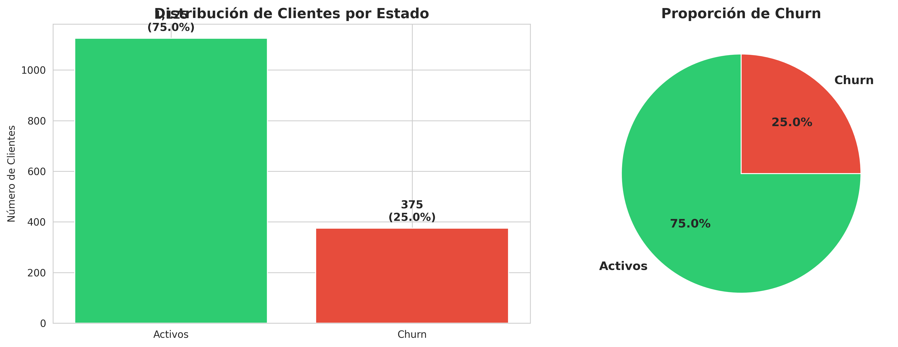
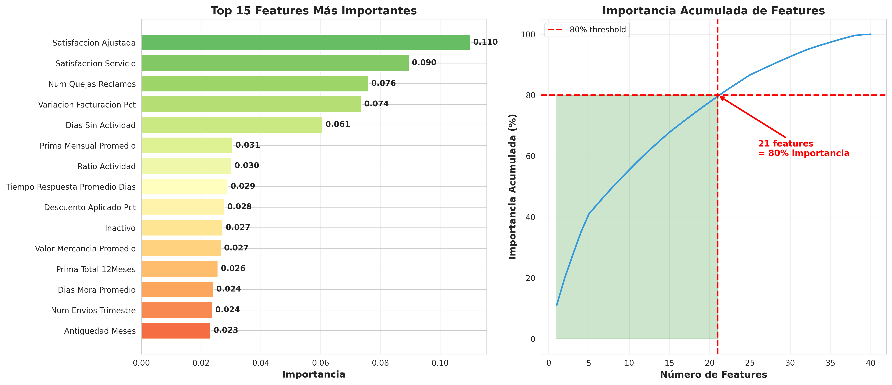

# 🎯 Predicción de Churn en Seguros de Carga

[](https://www.python.org/)
[](https://scikit-learn.org/)

> Modelo de Machine Learning que identifica clientes con alto riesgo de cancelación, permitiendo estrategias de retención proactivas.

---

## 📊 Resumen Ejecutivo

Este proyecto predice qué clientes de seguros de carga tienen mayor probabilidad de cancelar su póliza. El modelo analiza 40 variables de comportamiento, facturación y servicio para generar alertas tempranas.

**Resultados:**
- ✅ **183 clientes** identificados para acción inmediata
- ✅ **100% de recall** con threshold optimizado
- ✅ **$4.947.737.448 COP** en facturación anual en riesgo identificada

---

## 🎯 Problema de Negocio

Las empresas de seguros de carga enfrentan una **tasa de churn del 25% anual**, lo que representa:
- Pérdida de ingresos recurrentes
- Alto costo de adquisición (5x más caro que retener)
- Dificultad para identificar señales tempranas

**Objetivo:** Crear un modelo que identifique clientes en riesgo antes de que cancelen.

---

## 📈 Resultados Principales

### Clientes por Nivel de Riesgo

| Nivel | Clientes | % | Acción Recomendada |
|-------|----------|---|-------------------|
| 🔴 Crítico | 125 | 31.2% | Llamada gerencial urgente |
| 🟠 Alto | 58 | 14.5% | Contacto ejecutivo |
| 🟡 Medio | 90 | 22.5% | Monitoreo proactivo |
| 🟢 Bajo | 127 | 31.8% | Servicio normal |

### Top 3 Predictores de Churn

1. **Quejas/Reclamos** (0.396) - Clientes con churn tienen 3x más quejas
2. **Días sin Actividad** (0.211) - 57% más días inactivos
3. **Loss Ratio** (0.063) - Siniestralidad >100% indica riesgo

### Performance del Modelo

- **Algoritmo:** Random Forest
- **ROC-AUC:** 0.808
- **Recall:** 100% (threshold 0.10)
- **Precision:** 66.7% (threshold 0.50)

---

## 🛠️ Stack Técnico
Python 3.12
├── scikit-learn (Random Forest, Logistic Regression, Gradient Boosting)
├── pandas, numpy (Análisis de datos)
├── matplotlib, seaborn (Visualización)
└── Google Colab (Desarrollo)

**Proceso:**
1. Análisis Exploratorio (1,500 clientes históricos)
2. Feature Engineering (10 variables nuevas creadas)
3. Entrenamiento de 5 modelos
4. Optimización de threshold
5. Predicciones en 400 clientes activos

---

## 📊 Visualizaciones

### Distribución de Churn


### Feature Importance


### Optimización de Threshold


---

## 📁 Estructura del Proyecto
Churn-Clientes/
├── Churn_Prediction_Complete_Analysis.ipynb  # Notebook completo
├── outputs/                                   # Gráficos y reportes
├── data/                                      # Descripción de datos
├── models/                                    # Información de modelos
└── README.md                                  # Este archivo

---

## 🚀 Cómo Usar

### Ver Resultados (5 min)
- Navega a `/outputs/` para ver gráficos
- Lee `resumen_ejecutivo.txt`

### Ver Código (15 min)
- Abre `Churn_Prediction_Complete_Analysis.ipynb`
- GitHub muestra automáticamente el código

### Ejecutar (60 min)

**Google Colab:**
1. Abre el notebook en Colab
2. Conecta Google Drive
3. Ejecuta celdas en orden

**Local:**
```bash
git clone https://github.com/Estefacervera/Churn-Clientes.git
cd Churn-Clientes
pip install -r requirements.txt
jupyter notebook


Implementación:

Fase 1: Piloto con top 20 críticos
Fase 2: Escalar a todos los críticos
Fase 3: Automatización y monitoreo continuo


🎓 Aprendizajes

Feature Engineering > Algoritmos complejos - Las variables creadas fueron más predictivas que las originales
Threshold depende del negocio - No hay valor óptimo universal
Interpretabilidad importa - Random Forest ganó por claridad en feature importance


📬 Contacto
Estefanía Cervera | Data Analyst

🐙 GitHub

⭐ Si este proyecto te resultó útil, dale una estrella en GitHub
